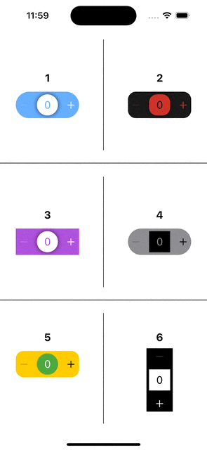
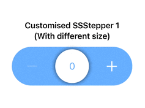
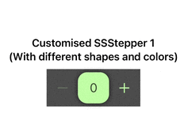
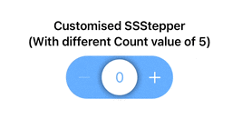
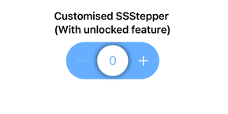
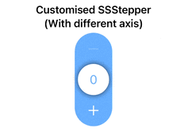

<a href="https://www.simform.com/"></a>

# SSStepper

[](https://cocoapods.org/pods/SSStepper)
[](https://cocoapods.org/pods/SSStepper)
[![Swift Version][swift-image]][swift-url]
[![PRs Welcome][PR-image]][PR-url]
[](https://twitter.com/simform)

SwiftUI package for creating custom stepper with gesture controls and flexible design as per your choice.

<br/>
*An example of Custom steppers created with this library*

**About SSStepper**<br/>
It supports stepper operation by swiping. By swiping up user can directly shift to maximum value that you have set. By swiping down user can directly shif to minimum value that you have set. And by swiping left and right user can increse or decrease the value by count that you have set. It is fully customisable by Shapes of backgorund view and top view alogn with colors, Directions, haptic feedbacks, colors of icons and Text, axis of stepper whether you want vertical or Horizontal.

## Example

To run the example project, clone the repo, and run `pod install` from the Example directory first.

## Requirements

This pod requires a deployment target of iOS 13.0 or greater

## Installation

### Cocoapods

SSStepper is available through [CocoaPods](https://cocoapods.org). <br/>To install
it, simply add the following line to your Podfile:

```ruby
pod 'SSStepper'
```
and run `pod install` from the root directory of project and in your code add `import SSStepper` and boom you're done.💥

### Swift Package Manager

When using Xcode 11 or later, you can install `SSLineChart` through [Swift Package Manager](https://swift.org/package-manager/) by going to your Project settings > `Swift Packages` and add the repository by providing the GitHub URL. Alternatively, you can go to `File` > `Swift Packages` > `Add Package Dependencies...`

### Manually

1. Add `SSStepper.swift`, `ContentView.swift` and `StepperModel.swift` to your project.
2. Grab yourself a cold 🍺.

## Usage

Import the package in the file you would like to use it: 

```swiftui
import SSStepper
```

This library shares one View which you can use as a stepper with lots of customization lke shapes, axis, count value and many more.
Basic example:

```swift
@State private var number: Int = 0
...
var body: some Scene {
    SSStepper(value: $number)
}
```
The results of any interaction with input stepper will be available in declared `number` state variable.

Customizations
===

You can customize almost every main thing in This library.
For Customizations you have to pass another value of `StepperModel` during call of SSStepper. This stepperModel argument is optional as well as Every arguments in `StepperModel` is also Optional. So, you need to add only those arguments which yo wanted to customize. Here's the examples :

Change in Size
-----

<br/>
*An example of Custom Size SSSteppers created with this library*

```swift
@State private var number: Int = 0
...
var body: some Scene {
    SSStepper(
            value: $firstCustomisedNumber,
            stepperModal: StepperModal(
                            size: .init(width: 200, height: 60)
                        )
            )
}
```

Change in Shapes ans its Colors
-----

<br/>
*An example of Custom Shape and Color of SSSteppers created with this library*

```swift
@State private var number: Int = 0
...
var body: some Scene {
    SSStepper(
            value: $firstCustomisedNumber,
            stepperModal: StepperModal(
                            innerShape: .rectangle(color: .yellow),
                            outerShape: .roundedRectangle(color: .red)
                        )
            )
}
```
Change in count value
-----

<br/>
*An example of default count value of SSSteppers created with this library*

```swift
@State private var number: Int = 0
...
var body: some Scene {
    SSStepper(
            value: $firstCustomisedNumber,
            stepperModal: StepperModal(
                            countValue: 5
                        )
            )
}
```
By passing this argument you can change the default increment/decrement value from 1 to anything.

Change in Locking System
----

<br/>
*An example of default locking system of SSSteppers created with this library*

```swift
@State private var number: Int = 0
...
var body: some Scene {
    SSStepper(
            value: $firstCustomisedNumber,
            stepperModal: StepperModal(
                            direction: .allDirection
                        )
            )
}
```
By passing this argument you can change locking system in library.
    <br/>1. if you select `.allDirection` than you can move to vertical point during the horizontal swipe
    <br/>2. If you select `.oneDirection` than you can not move to vertical points during horizontal swipe or vice versa. (By default this is selected)
    
Change in Axis of SSStepper
----------

<br/>
*An example of default axis system of SSSteppers created with this library*

```swift
@State private var number: Int = 0
...
var body: some Scene {
    SSStepper(
            value: $firstCustomisedNumber,
            stepperModal: StepperModal(
                            axis: .vertical
                        )
            )
}
```
By passing this argument you can change Axis of SSStepper in library.

Other Customizations
===

Minimum and Maximum Value
---

1. You can add maxNumber argument for setting up maximum number of Stepper. By default is `100`.<br/>
2. You can add minNumber argument for setting up minimum number of Stepper. By default is `0`.

```swift
@State private var number: Int = 0
...
var body: some Scene {
    SSStepper(
            value: $firstCustomisedNumber,
            stepperModal: StepperModal(
                            maxNumber: 100,
                            minNumber: 1 
                        )
            )
}
```

Text Color and Icon Color
-------

1. You can add textColor argument for setting up Text Color of Stepper. By default is innerShape or Background shape color that you've set or default color `accentColor`'.<br/>
2. You can add iconColor argument for setting up Icon Color of Stepper. By default is outerShape or Foreground shape color that you've set or default color `White`'.

```swift
@State private var number: Int = 0
...
var body: some Scene {
    SSStepper(
            value: $firstCustomisedNumber,
            stepperModal: StepperModal(
                            textColor: .red
                            iconColor: .white 
                        )
            )
}
```

Haptic Feedback Style
------

1. You can add feedbackStyle argument for setting up Haptic Feedback Style of Stepper. By default is `.light`.

```swift
@State private var number: Int = 0
...
var body: some Scene {
    SSStepper(
            value: $firstCustomisedNumber,
            stepperModal: StepperModal(
                            feedBackStyle: .heavy
                        )
            )
}
```

Shadow
-------

1. By default there is an shdow between inner view and outer view. You can disable it by passing this value as false.
 
```swift
@State private var number: Int = 0
...
var body: some Scene {
    SSStepper(
            value: $firstCustomisedNumber,
            stepperModal: StepperModal(
                            showShadow: false
                        )
            )
}
```

Center Text
-----------

1. This property is used to change text between buttons which shows when users minimizes or maximizes the value by swiping vertical. Default value for maximum is `MAX` and default value for Minimum is `MIN`.
 
```swift
@State private var number: Int = 0
...
var body: some Scene {
    SSStepper(
            value: $firstCustomisedNumber,
            stepperModal: StepperModal(
                            minText: "mínima",
                            maxText: "máxima"
                        )
            )
}
```
Error Shake Animation
-----------

1. This property is used to change whether you want the `Shake` aniamtion on error while value is already at minimum or maximum. By default value is `true`.
 
```swift
@State private var number: Int = 0
...
var body: some Scene {
    SSStepper(
            value: $firstCustomisedNumber,
            stepperModal: StepperModal(
                            showErrorShakeAnimation = false
                        )
            )
}
```

Disable Vertical scroll Minimum/Maximum
-----------

1. This property is used to change whether you want to allow vertical scroll to jump directly to minimum or maximum values. By default value is `true`.
 
```swift
@State private var number: Int = 0
...
var body: some Scene {
    SSStepper(
            value: $firstCustomisedNumber,
            stepperModal: StepperModal(
                                enableVerticalMinMax = false
                        )
            )
}
```

## Coming Soon

1. Pass custom views instead of default Plus(+) and Minus(-) icon.<br/>
2. Feature to discard operation on placing outer view to its place.<br/>
3. Hold the Increse/decrease Buttons to operate continuously until hold.

**Up for a suggestions. Give suggestions for more features and customisations.**

## 🤝 How to Contribute

Whether you're helping us fix bugs, improve the docs, or a feature request, we'd love to have you! :muscle:

Check out our [**Contributing Guide**](CONTRIBUTING.md) for ideas on contributing.

## Find this example useful? ❤️

Give a ⭐️ if this project helped you!

## Check out our other Libraries

<h3><a href="https://github.com/SimformSolutionsPvtLtd/Awesome-Mobile-Libraries"><u>🗂 Simform Solutions Libraries→</u></a></h3>

## MIT License

This project is licensed under the MIT License - see the [LICENSE](LICENSE) file for details

[PR-image]:https://img.shields.io/badge/PRs-welcome-brightgreen.svg?style=flat
[PR-url]:http://makeapullrequest.com
[swift-image]:https://img.shields.io/badge/swift-5.0-orange.svg
[swift-url]: https://swift.org/
